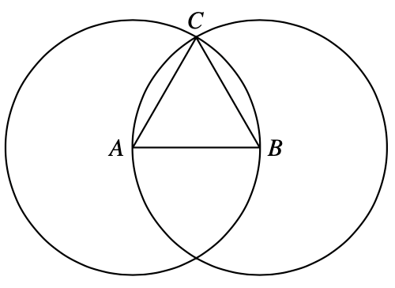

# Equilateral triangle

Given two points $A$ and $B$ in the plane, we can construct a circle centered at $A$ and with radius $AB$, and a circle centered at $B$ and with radius $AB$. The two circles will intersect at two different points $C_1$ and $C_2$. The points $A$, $B$ and $C_1$ will form an equilateral triangle.

Repeating that strategy one can: (1) tesselate the plane into equilateral triangles, (2) construct a regular hexagon, (3) tesselate the plane into regular hexagons,

# Constructing a parallel

Note that the equilateral triangle construction also provides a way of constructing perpendicular lines. Indeed the segment $AB$ is perpendicular to $C_1C_2$. We can modify this method to find a perpendicular line to $AB$ crossing an arbitrary point $C$

Repeating this process twice, we can get a line parallel $AB$ and that crosses the point $C$