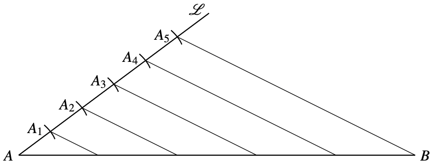

# Bisecting a line segment

In the construction of the equilateral triangle, note that the line segment $C_1C_2$ bisects the line segment $AB$

To bisect and arc $\angle AOB$, we find the bisection $C$ of the segment $AB$. It turns out that $\angle AOC$ bisects the arc as well.

Note that this construction only works for bisecting angles but not for dividing the angle into three or more parts.

# Dividing a line into $n$ equal parts

Consider a segment $AB$. Construct a ray $R$ starting at $A$ and not crossing $B$. Use the compass to find $n$ equistant points $P_1, \dots, P_n$ in the ray $R$ starting at $A$. Consider the lines parallel to $P_nB$ and crossing $P_m$. These lines intersect the segment $AB$ at equidistant points.

