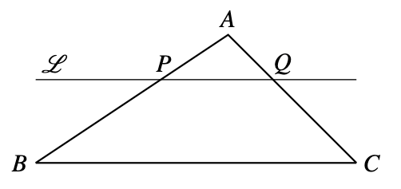
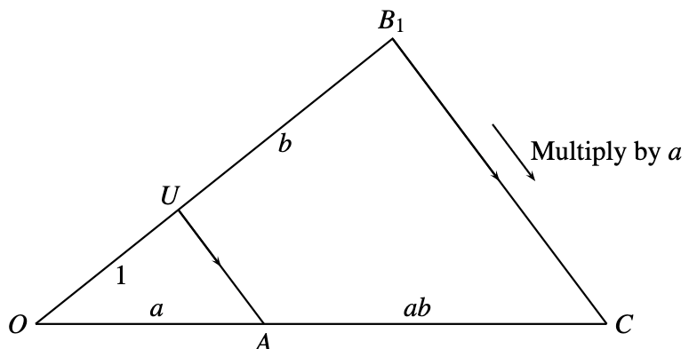
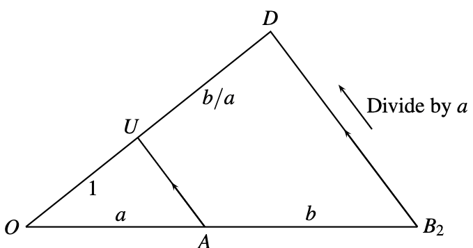

Consider a triangle $ABC$, and a line parallel to $BC$ and intersecting the triangle at points $P$ (in the segment $AB$) and $Q$ (in the segment $AC$). Then $AP/PB=AQ/QC$.

# Multiplication and division

