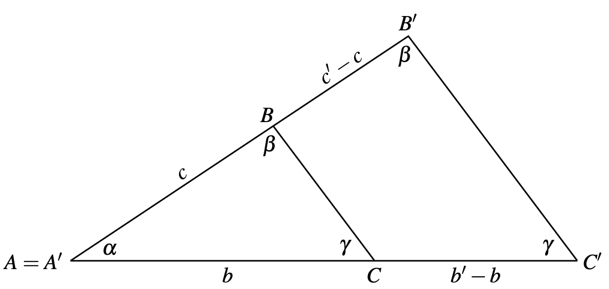
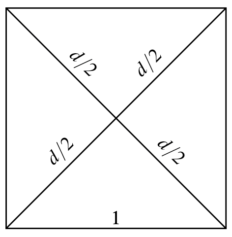

Triangles $ABC$ and $A'B'C'$ are similar when their corresponding angles are equal.

If trianles are similar, then their corresponding sides are proportional. 

Using similar triangles we can see that the diagonal of a square must have lenght equal to square root of one of his sides.

