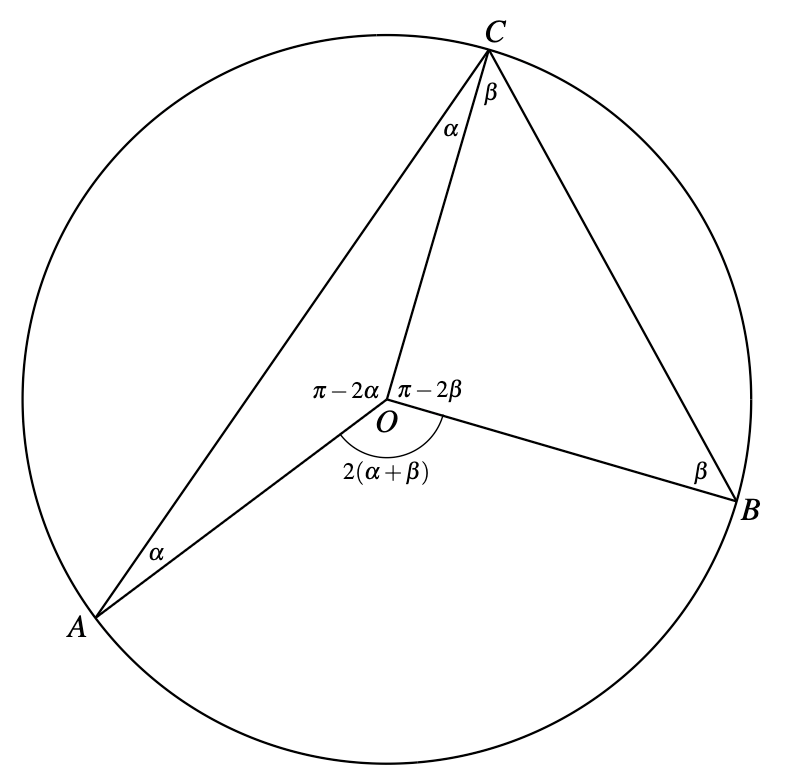
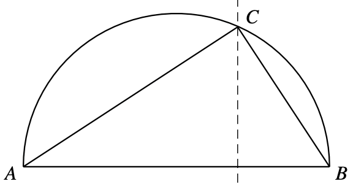

If $A$ and $B$ are two points on a circle, then for all points $C$ on one of the arcs connecting them, the angle $ACB$ is constant

The case of the semicircle is often useful because it leads to a constant right angle

