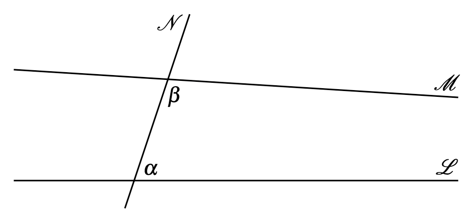

# Euclid's parallel axiom

Is a straight line crosses two straight lines makes the interior angles on one side together less than $\pi$ radians, then the two straight lines will meet on that side.

If $\alpha + \beta < \pi$, the lines $M$ and $L$ will intersect on the right.

# Modern parallel axiom

Given any line $L$ and any point $P$ outside the line, there exists exactly one parallel line $M$ throught that point that does not meet $L$

# Angles in a triangle

The sum of the internal angles of a triangle add up to $\pi$.