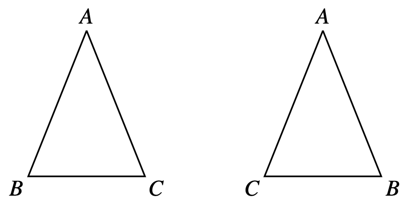
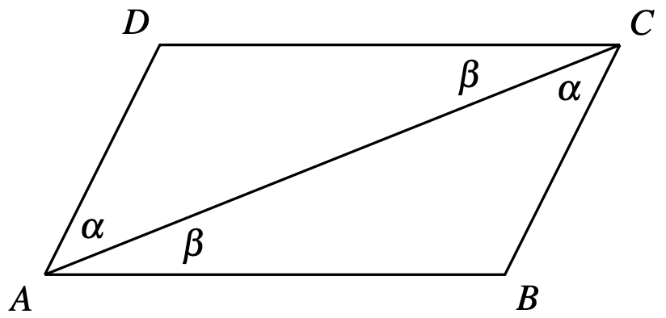

# ASA (Side-Angle-Side) axiom

Let $ABC$ and $A'B'C'$ be two triangles. If $|AB|=|A'B'|$, $\angle ABC = \angle A'B'C'$, and $\angle BAC = \angle B'A'C'$, then the two triangles are congruent. 

Similarly, we have an, $SAS$ and $SSS$ axioms. 

# Isoceles triangle theorem

A triangle with two sides of equal length have angles oposite to these sides also equal.

# Parallelegram side theorem

Opposite sides of a parallelogram have the same lenght

