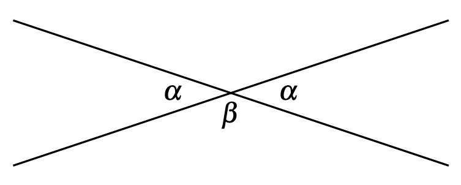
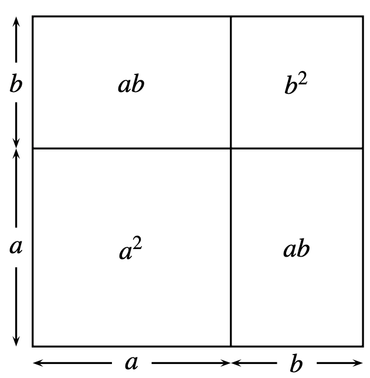

# Common notions

Axioms used to give meaning of equality of quantities

1. Things equal to the same thing are also equal to one another
2. If equals are added to equals, the wholes are equal
3. If equals are subtracted from equals, the remainders are equal
4. Things that coincide with one another are equal to one another
5. The whole is greater than the part.

# Examples

## Opposite angles 

## Square of a sum

