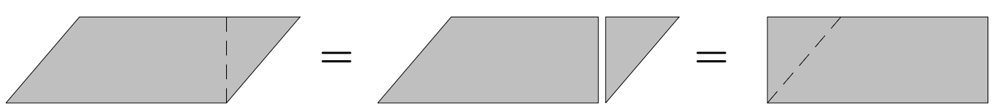
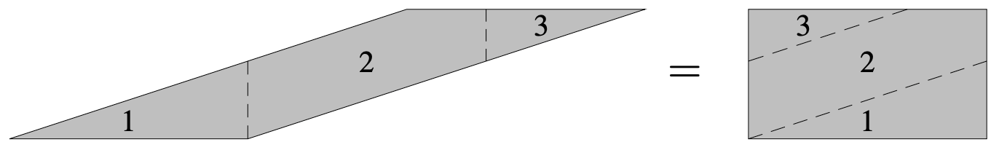
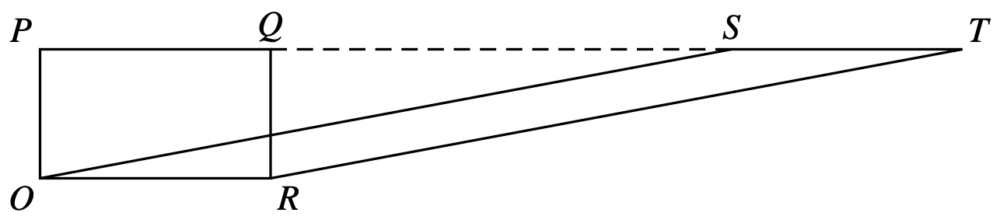
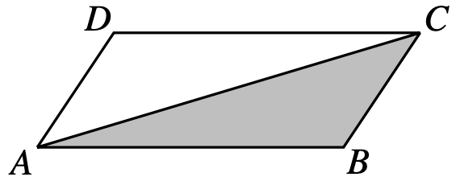

For Euclid, area is always the area of a rectangle. For other geometric objects, Euclid finds equivalences using his common notions.

# Parallelogram

Using just one cut

Using multiple cuts

Using also subtraction. We notice that the triangles $POS$ and $QRT$ are congruent.

# Triangles

Any triangle can be seen as half a parallelogram

