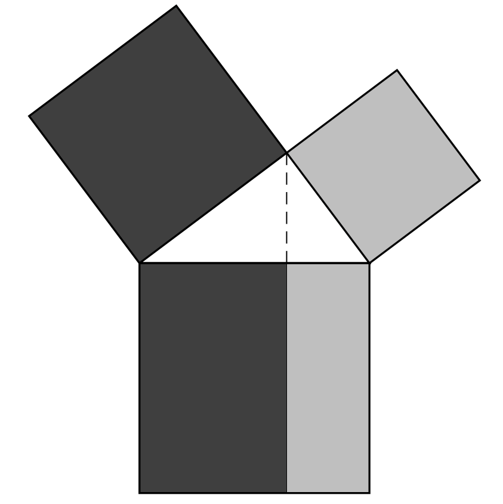
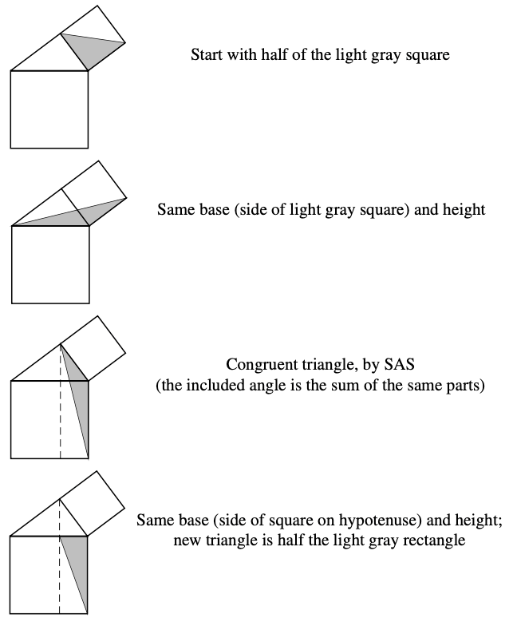

For any right-angled triangle, the sum of the squares on the two shorter sides equals the square on the longest side.

The dark regions have the same area, and the light regions have the same area

To notice that those regions have the same are, consider the following transformations

