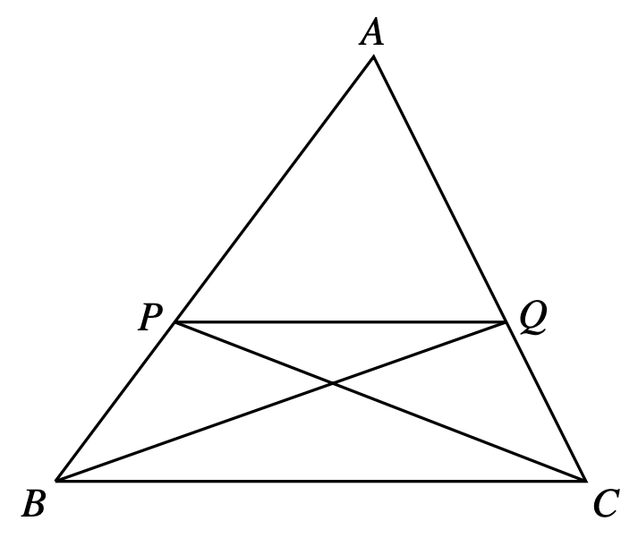

A line drawn parallel to one side of a triangle cuts the other two sides proportionally

Considering the line $AB$ as the base, triangles $APQ$ and $PQB$ have the same height, and therefore their areas are proportional to their base. Namely

$$
\frac{\text{Area of $APQ$}}
{\text{Area of $PBQ$}}
=
\frac{|AP|}
{|PB|}
$$

Similarly, for triangles $AQP$ and $QPC$ we get

$$
\frac{\text{Area of $APQ$}}
{\text{Area of $QCB$}}
=
\frac{|AQ|}
{|QC|}
$$

Moreover, we claim that the area of $PQB$ equals the area of $QBC$. To see this, note that the have the same base $PQ$ and the same height with respect to that base.

Combining that, we get 

$$
\frac{|AP|}{|PB|}
=
\frac{|AQ|}{|QC|}
$$