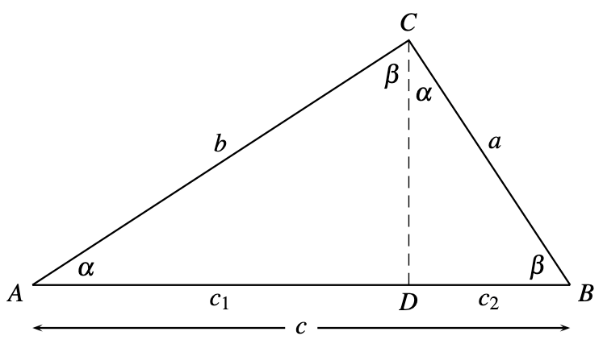
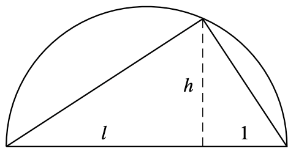

We can also proof the pythagorean theorem using similarity of triangles:

The triangles $ABC$, $ACD$ and $CBD$ are similar. Therefore 

$$
\frac{a}{c} = \frac{c_2}{a} 
\qquad
\frac{b}{c} = \frac{c_1}{b} 
$$

Leading to $a^2 = c_2 c$ and $b^2=c_1 c$. Adding these two equations we get the result.

# Construction of square root

Using the pythagorean theorem and similarity of angles, we can construct the square root of any constructible number $l$ as the length $h$ in the following diagram

