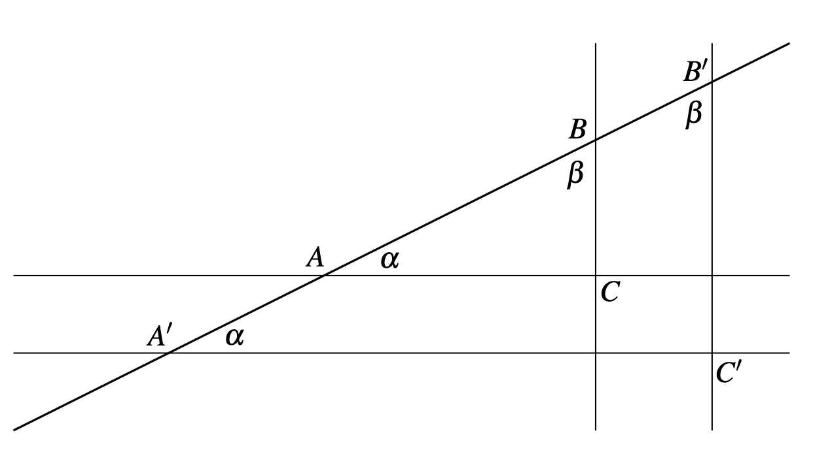

The **slope** between two points $A$ and $B$ (with respect to the x and y axis) is given by the quotient rise and run, namely $|BC|/|AC|$ as shown in the figure:

The slope of different pair of points in a line is an invariant (we can check this using Thales theorem). 

Therefore, two different points $A$ and $B$ form a slope $m$. The line passing through those two points is the set of points $C$ that form the same slope $m$ to either $A$ or $B$. 

If the slope is finite (that is, if the "over" is different from 0), this leads to the equation

$$
y=mx+c
$$

In the general case, the points in a line satisfy the equation

$$
ax+by+c=0
$$

## Consequences

- There is a unique line through any two distinct points
- Given a line $L$ and a point $P$ outside the line, there is only one line through $P$ not meeting $L$

