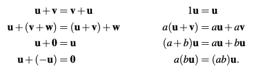

A **vector space** $V$ over a the real numbers, is a set of vectors satisfying the properties in the following figure:

where the bold letters are vectors and the non-bold letters are real numbers (usually called scalars). The axioms are the same when one considers vector spaces over fields other than the real numbers.

