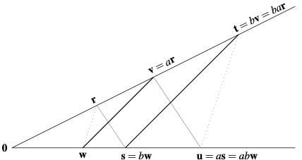

Two vectors $\mathbf{u},\mathbf{v} \in V$ are linearly independent :iff $a\mathbf{u}+b\mathbf{v}=0$ implies that both $a$ and $b$ are equal to zero. This means that the two vectors lie in different directions (around zero).

Two vectors are **parallel** when they are linearly dependent.

Using the language of vectors, we can prove the following theorems:

# Thales theorem

Let $\mathbf{u},\mathbf{v} \in \mathbb{R}^2$ be two linearly independent vectors. If $\mathbf{u}-\mathbf{v}$ is parallel to $a \mathbf{u}-a'\mathbf{v}$ then $a=a'$.

# Pappus theorem

Let $\mathbf{u},\mathbf{v}, \mathbf{w} \in \mathbb{R}^2$ be pairwise linearly independent vectors. If $\mathbf{u}-\mathbf{v}$ is parallel to $a \mathbf{u}- a'\mathbf{v}$, and $\mathbf{v}-\mathbf{w}$ is parallel to $a' \mathbf{v}- a''\mathbf{w}$, then $a=a'=a''$. Moreover $\mathbf{u}-\mathbf{w}$ will be parallel to $a\mathbf{v}-a''\mathbf{w}$.

