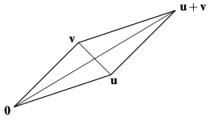
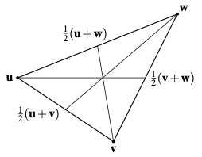

The midpoint between two vectors $\mathbf{u}$ and $\mathbf{v}$ is given by $\frac{1}{2}(\mathbf{u}+\mathbf{v}) = \mathbf{v}+\frac{1}{2}(\mathbf{u}-\mathbf{v})$.

# Concurrence of Medians

The medians of any triangle pass through the same point, namely the centroid of the triangle

