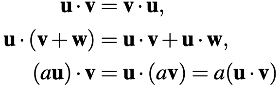
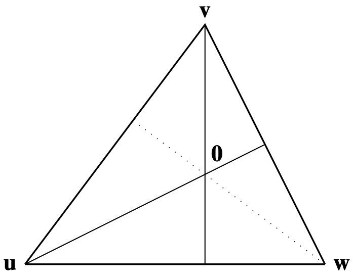
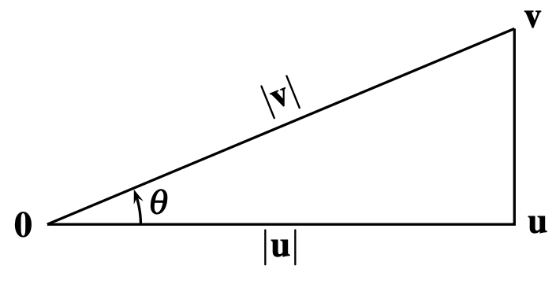
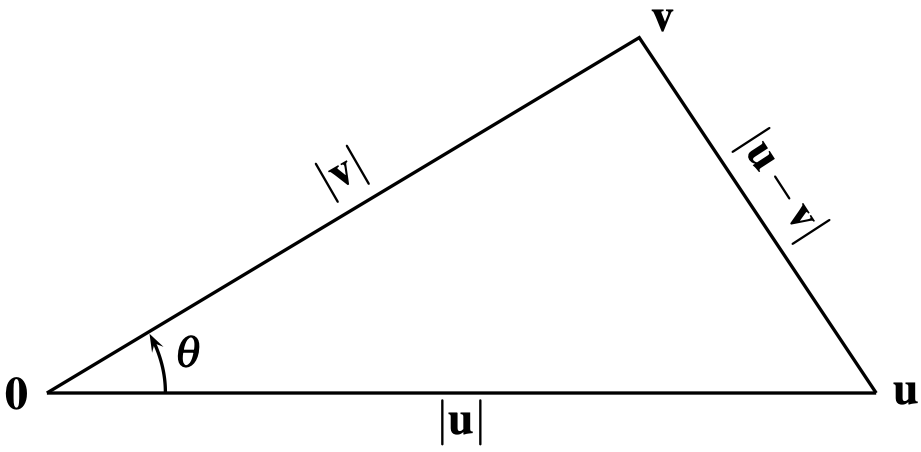

The inner product satisfies the properties in the following picture:

Note that the distance of a vector is given by $|\mathbf{v}|= \sqrt{\mathbf{v} \cdot \mathbf{v} }$. 

Moreover, two vectors are perpendicular if and only if $\mathbf{v} \cdot \mathbf{u}=0$

# Concurrence of altitudes

For any triangle, the perpendiculars from the vertices of opposite sides (the altitudes) have a common point.

# Inner product and cosine

$$
\mathbf{v} \cdot \mathbf{u} = |\mathbf{v}|  |\mathbf{u}| \cos(\theta)
$$

## Cosine rule

$$
|\mathbf{v} - \mathbf{u}|^2 = |\mathbf{v}|^2 + |\mathbf{u}|^2 - 2|\mathbf{v}|  |\mathbf{u}| \cos(\theta)
$$

