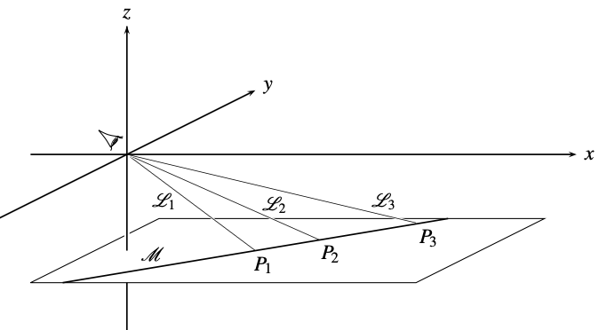
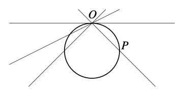

## Projective plane axioms
- Any two "points" are contained in a unique "line".
- Any two "lines" intersect at a unique "poin"t.
- there are at least 4 non colinear "points".

We use quotation marks for "points" and "lines" since those objects are different than their counterparts in euclidean geometry (that is, we will reserve the names: points and lines for the ones of the euclidean geometry)

## The real projective plane

In the real projective plane $\mathbb{R} \mathbb{P}^2$ consists of

- "Points" are lines on $\mathbb{R}^3$ crossing the origin.
- "lines" are planes on $\mathbb{R}^3$ crossing the origin.

One can project the "points" and "lines" of the real projective plane into points and lines of the plane $z=-1$:

### Finding a surface that behaves like the real projective plane is hard.

We can however find curves that behave like "lines" of the real projective plane:

