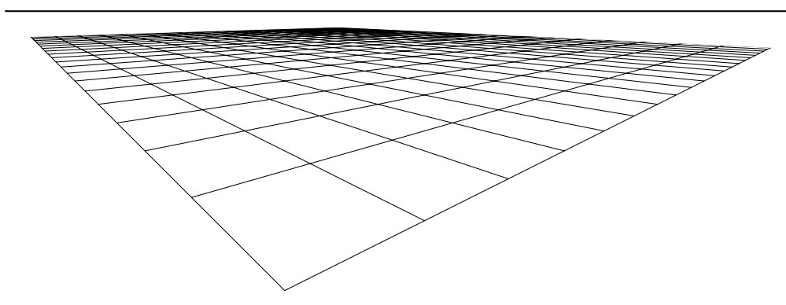
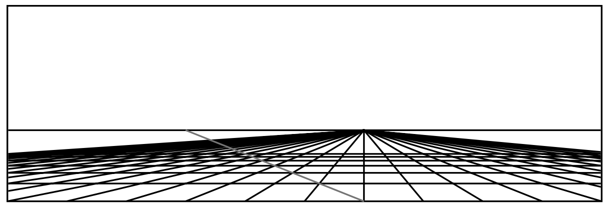

In this section, we consider geometry only with a straighedge. Therefore, we dismiss the concepts of angle and distance. Turns out that in this geometry, we still can represent interesting figures such as the following tiled floor:

The idea of perspective was introduced by italian artists in the 15th century in a technique called _construzione legittima_. 

This construction involves the construction of parallel lines and of equal spacing, and therefore it is part of euclidean geometry.

What do we need to construct a tiled floor using straightedge alone?